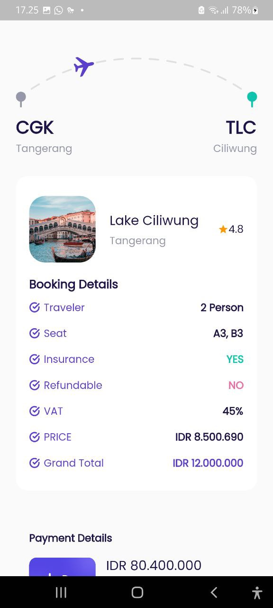
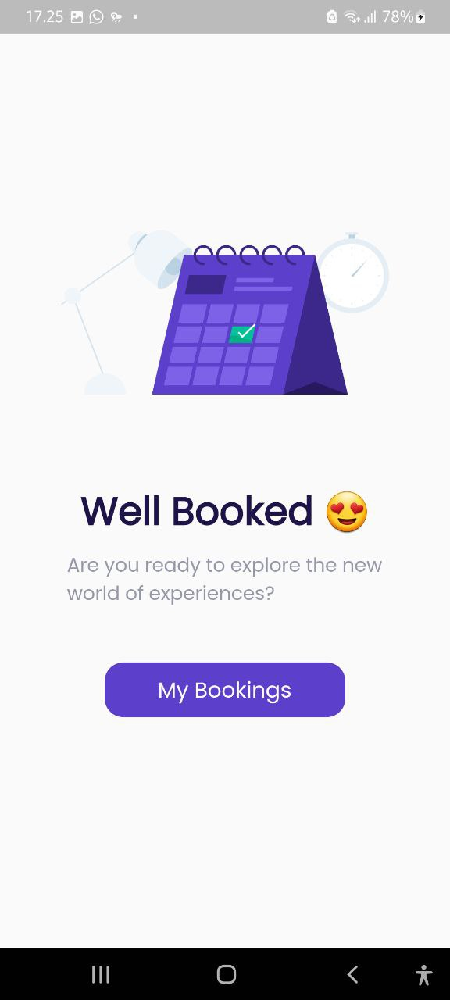
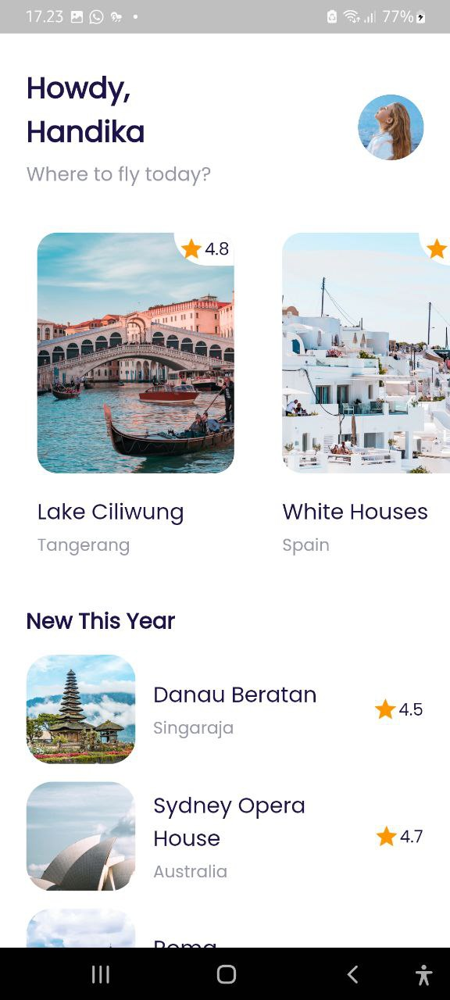
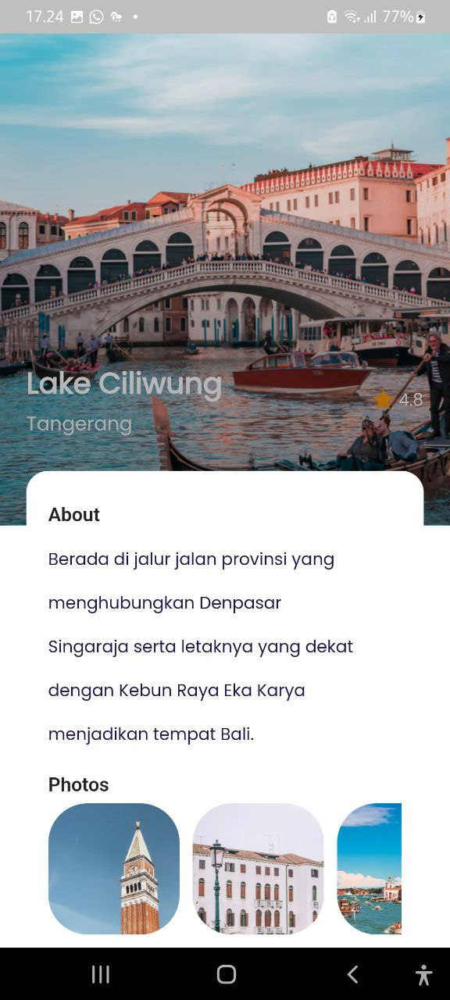
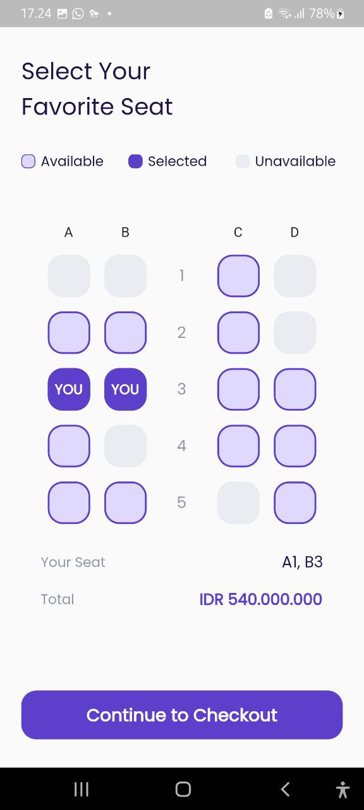
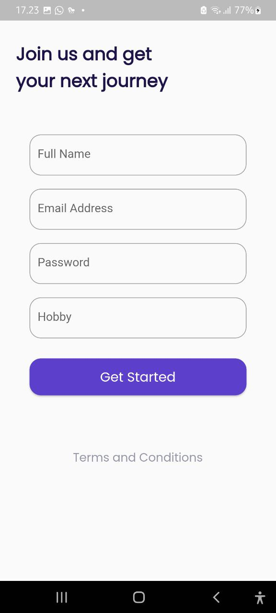
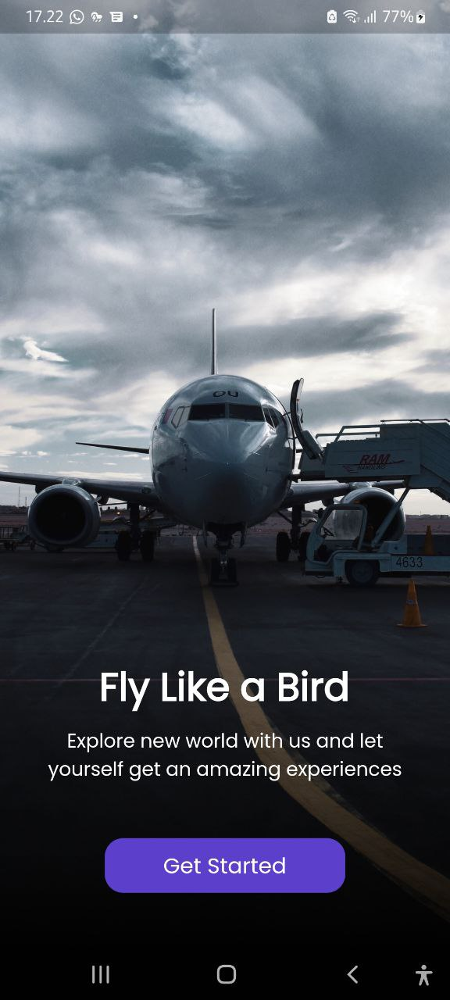
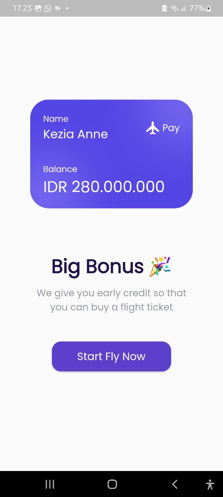

# FLUTTER APP : Airplane App

### Description
Create application to booking airline ticket (Slicing and connect to Firebase).

### Features
- Auth
- Get Data from Firebase

### Package
- google_fonts
- responsive_framework
- auto_route
- flutter_native_splash
- equatable
- firebase_core
- firebase_auth
- cloud_firestore
- bloc
- flutter_bloc
- get_it

### Tech Used
 
 

## Screenshots

  | |

  | |

  |  | |